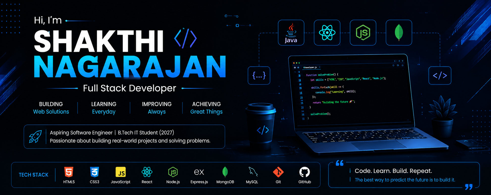

<!-- Banner -->

<!-- Typing Animation -->

<!-- Introduction -->
### Hi there 👋, I'm Shakthi!

🔭 I'm actively seeking Software Development Internship opportunities and open to work.

🌱 I'm currently learning Java, React, Node.js, MongoDB, JavaScript, HTML, CSS, and Data Structures & Algorithms.

💼 I'm actively looking for a Software Development Internship (Frontend, Full Stack, or Java Developer roles).

💬 Ask me about Java, MERN Stack, Web Development, Git, GitHub, HTML, CSS, and JavaScript.

🎯 My goal is to become a Software Engineer and build scalable, high-quality web applications.

⚡ Fun fact: I enjoy building real-world projects, learning new technologies, and solving coding challenges every day.

 

<!-- Contact Info -->
### 📫 Connect with me:
- **Email:** shakthi11.dev@gmail.com
- **Phone:** 6374186403
- **LinkedIn:** [shakthi-nagarajan-b58855402](https://www.linkedin.com/in/shakthi-nagarajan-b58855402/)
- **GitHub:** [shakthi-DEV11](https://github.com/shakthi-DEV11)

 

<!-- Skills -->
### 💻 Skills & Tools:

  

 

<!-- GitHub Stats & Top Languages -->
### 📊 GitHub Analytics:

  
  

 

<!-- Activity Graph -->
### 📈 GitHub Activity Graph:

  

 

<!-- Featured Projects -->
### 🚀 Featured Projects:
| Project | Description | Link |
| ------- | ----------- | ---- |
| **Project Alpha** | A brief description of what this project does and the tech stack used. | [View Project](#) |
| **Project Beta** | A brief description of what this project does and the tech stack used. | [View Project](#) |

