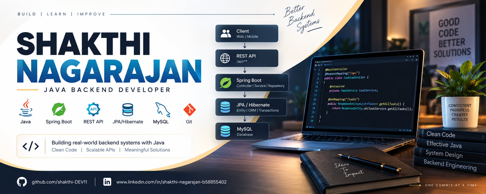

<!-- Banner -->

 
 

# Hi, I'm Shakthi Nagarajan

### Java Backend Developer | B.Tech IT Student

*Building backend systems with Java, Spring Boot, REST APIs and relational databases.*

---

## 👨‍💻 About Me

I am a B.Tech IT student with a strong focus on **Java Backend Development**. I am actively building scalable backend applications and APIs. My primary focus is strengthening my foundation in Core Java, Object-Oriented Programming (OOP), SQL, and backend engineering principles. I consistently practice problem-solving (DSA) and build projects to better understand real-world software architecture and maintainable code.

## 🚀 Currently Building

- **Core Java & OOP:** Deepening my understanding of Collections, Multithreading, and Exception Handling
- **Problem Solving:** Consistently practicing DSA
- **Spring Boot & REST APIs:** Learning to build robust and scalable APIs
- **Database Design:** Working with SQL and relational databases (MySQL, PostgreSQL)
- **Architecture:** Understanding clean architecture and layered application design
- **Testing:** Learning unit testing with JUnit

## 🛠️ Technology Stack

### Backend
Java | Spring Boot (Learning) | Spring MVC (Learning) | REST API | Spring Data JPA (Learning) | Hibernate (Learning)

### Database
MySQL | PostgreSQL | SQL

### Testing
JUnit (Learning) | Mockito (Learning)

### Tools
Git | GitHub | Maven | Postman | IntelliJ IDEA

### Currently Learning
Spring Security | JWT | Docker | CI/CD | System Design

 

  

 

## ☕ Core Java Knowledge

I am building a strong foundation in Core Java, emphasizing:
- **OOP Principles:** Encapsulation, Inheritance, Polymorphism, Abstraction
- **Core Concepts:** Constructors, `this`/`super`, Method Overloading/Overriding
- **Structure:** Interfaces, Abstract Classes
- **Robustness:** Exception Handling
- **Data Structures:** Collections Framework, Generics, Arrays, Strings, StringBuilder/StringBuffer
- **Advanced Features:** Java 8+ features, Streams, File Handling, Multithreading

## ⚙️ Backend Engineering Concepts

In my backend journey, I am focusing on:
- RESTful API design
- Layered architecture (Controller / Service / Repository pattern)
- Data Transfer Objects (DTOs)
- Entity relationships and JPA/Hibernate
- Input validation and Global exception handling
- HTTP status codes
- Authentication & Authorization concepts
- Database transactions

## 🚧 Backend Projects In Progress

Currently, my GitHub repositories are focused on learning materials, but I am actively developing real-world backend projects that will be published soon.

### 1. Java Practice & OOP Concepts
A comprehensive repository containing my daily Java practice, focusing on Core Java, OOP principles, and basic algorithm implementations.
**Tech:** Java
*Status: In Development (Local)*

### 2. E-Commerce API (Planned)
Designing a RESTful backend for an e-commerce platform with layered architecture, user authentication, and product management.
**Tech:** Java | Spring Boot | MySQL | REST API
*Status: Planning Phase*

## 🧠 Problem Solving

I regularly practice Data Structures and Algorithms to improve my problem-solving skills, focusing on:
- Arrays & Strings
- Searching & Sorting algorithms
- Two Pointers & Hashing
- Recursion
- Linked Lists, Stacks, and Queues

## 💡 Engineering Principles

I strive to follow these practices in my development process:
- Write readable and clean code
- Separate business logic from controllers
- Validate input rigorously
- Handle exceptions properly
- Use meaningful naming conventions
- Avoid unnecessary duplication (DRY)
- Write testable code
- Prefer maintainable solutions over clever but unreadable code
- Document APIs and use Git consistently

## 📊 GitHub Analytics

  
  

 

  

## 📫 Connect With Me

- **GitHub:** [@shakthi-DEV11](https://github.com/shakthi-DEV11)
- **LinkedIn:** [Shakthi Nagarajan](https://www.linkedin.com/in/shakthi-nagarajan-b58855402/)
- **Email:** shakthi11.dev@gmail.com
